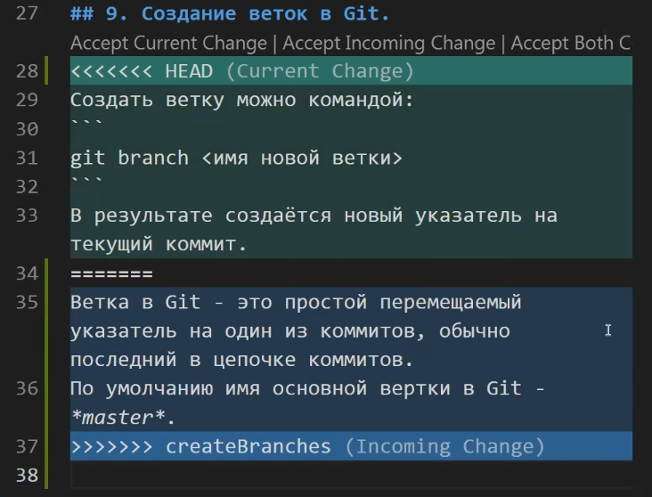

# Работа с Git

## 1. Проверка наличия установленного Git.
В терминале выполнить команду `git version`
Если Git установлен, появится сообщение с информацией о версии программы.
Иначе будет сообщение об ошибке.

## 2. Установка Git.
Загружаем последнюю версию Git с сайта https://git-scm.com/downloads. Устанавливаем с настройками по умолчанию.

## 3. Настройка Git.
При первом использовании Git необходимо представиться. 
Для этого нужно выполнить в терминале две команды:
```
git config --global user.name «Ваше имя английскими буквами»
git config --global user.email ваша почта@example.com
```
Теперь каждое наше действие будет отмечено именем и почтой. Таким образом, пользователи всегда будут в курсе, кто отвечает за какие изменения — это вносит порядок.
**Git** хранит весь пакет конфигураций в файле ``.gitconfig``, находящемся в локальном каталоге. Чтобы сделать эти настройки глобальными, то есть применимыми ко всем проектам, необходимо добавить флаг ``–global``. Если вы этого не сделаете, они будут распространяться только на текущий репозиторий.

## 4. Инициализация репозитория.
Для создания нового репозитория используется команда 
``git init``.

Команду ``git init`` выполняют только один раз для первоначальной настройки нового репозитория. Выполнение команды приведет к созданию нового подкаталога.

## 5. Запись изменений в репозитории. 
Каждый файл в рабочем каталоге может находиться в одном из двух состояний: под версионным контролем (отслеживаемые) и нет (неотслеживаемые). Отслеживаемые файлы — это те файлы, о которых знает **Git**.
Основной инструмент, используемый для определения, какие файлы в каком состоянии находятся — это команда ``git status``.
Понять, что <новый файл> неотслеживаемый можно по тому, что он находится в секции «Untracked files» в выводе команды ``git status``. Статус "Untracked" означает, что **Git** видит файл, которого не было в предыдущем коммите. **Git** не станет добавлять его в ваши коммиты, пока вы его явно об этом не попросите. 
Когда будете готовы сохранить копию текущего состояния проекта, индексируете изменения командой ``git add Имя файла``. Затем вызываете команду ``git commit -m Сообщение о коммите``, которая добавляет коммит в историю проекта. Для отмены коммита или проиндексированного снимка состояния используется команда ``git reset``. 

## 6. Просмотр истории коммитов.
Наиболее простой и в то же время мощный инструмент для этого — команда ``git log`` . По умолчанию, без аргументов, ``git log`` выводит список коммитов созданных в данном репозитории в обратном хронологическом порядке. То есть самые последние коммиты показываются первыми. 
Если вдруг коммитов у нас много и мы хотим посмотреть изменения определенного коммита, то мы можем написать команду ``git show`` и указать **id коммита**. И на экране мы видим то же самое, что мы видели, когда смотрели **дифф** незакоммиченых файлов.

## 7. Перемещение между сохранениями.
Чтобы перейти к определенному коммиту, используйте команду ``git checkout`` , но вместо имени ветки нужно использовать номер коммита. 
```
Коммиты можно вызвать командой git log, git log --graph
```
Для того что бы вернутся в актуальное состояние после перемещения по коммитам нужно использовать команду:
```
git checkout master
```

## 8. Игнорирование файлов.
Для того чтобы исключить из отслеживания в репозитории определенный файл или папку необходимо создать файл ***.gitignore*** и записать в него их названия или шаблоны, соответсвующие таким файлам или папкам.

## 9. Создание веток в Git.
В результате создается ноый указатель на текущий коммит.
Ветка в Git - это простой перемещаемый указатель на один из коммитов, обычно последний в цепочке коммитов. 
По умолчанию имя основной ветки в Git - *master*.
Создать ветку можно командой:
```
git branch <имя новой ветки>
```
Список веток в репозитории можно посмотреть с помощью команды 
```
git branch
```
Текущая ветка будет отмечена звездочкой: **\*master**

Создать новую ветку и переключиться на нее: 
```
git switch -c <новая ветка> или git checkout -b <новая ветка>
```
***-c и -b*** - означает создание. Вернуться к предыдущей извлечённой ветке: ***git switch -***.

## 10. Слияние веток и разрешение конфликтов.
При слиянии одной ветви с другой изменения файлов из фиксаций в одной ветви могут конфликтовать с изменениями в другой. **Git** пытается устранить эти изменения, используя журнал в репозитории, чтобы определить, как должны выглядеть объединенные файлы. Если не ясно, как объединить изменения, **Git** останавливает слияние и сообщает, какие файлы конфликтуют
Для слияния выбраной ветки с текущей нужно выполнить команду:
```
git merge <название выбранной ветки>
```
Если была измененая одна и та же часть файла в обеих ветках, то может возникнуть конфликт, который потребует участие пользователя. VSCode предлагает варианты разрешения:
```
Current change - принять текущее изменение.
Incoming change - входящее изменение.
Both change - оставить оба изменения.
```
* <<<<<<< HEAD
* =======
* \>>>>>>> newBranch

Новые строки можно рассматривать как «разделители конфликта». Строка ======= является «центром» конфликта. Все содержимое между этим центром и строкой <<<<<<< HEAD находится в текущей ветке, на которую ссылается указатель HEAD. А все содержимое между центром и строкой >>>>>>> newBranch является содержимым ветки для слияния.



После редактирования файла выполните сохранение (см. раздел 5) чтобы добавить новое объединенное содержимое в раздел проиндексированных файлов. Для завершения слияния создайте новый коммит.
**Git** обнаружит, что конфликт разрешен, и создаст новый коммит слияния для завершения процедуры слияния.

## 11. Удаление веток.
Для того что бы вывести все имеющиеся ветки используйие команду ``git branch`` обратите внимание на символ ``*``, стоящий перед веткой: он указывает на ветку, на которой вы находитесь в настоящий момент.
Чтобы удалить локальную ветку, можно использовать ``git branch`` команда с ``-d``, который удаляет ветвь только в том случае, если она была полностью объединена с вышестоящей ветвью.
```
git branch -d <название ветки>
```
Чтобы увидеть все ветки, содержащие наработки, которые вы пока ещё не слили в текущую ветку, выполните команду:
```
git branch --no-merged
```
Вы увидите ветку (если такая есть). Так как она содержит ещё не слитые наработки, попытка удалить её командой ``git branch -d`` приведёт к ошибке.
Если вы действительно хотите удалить ветку вместе со всеми наработками, используйте опцию ``-D``.

## 12. Работа с удаленными репозиториями.
**1. Создать аккаунт на GitHub.**

**2. Создать локальный репозиторий.**

**3. Связать удалённый репозиторий с локальным.**  
Добавить удалённый репозиторий к проекту:
```
git remote add <имя для репоитория> <url-адрес репозитория>
```
Иногда бывает так, что проект имеет несколько удаленных репозитариев – в таком случае каждому из них присваивается собственное имя. Главный репозитарий принято называть ``origin``.

Чтобы увидеть имя  привязанного удаленного репозитория нужно ввести комманду ``git remote``, ``-v`` - показывает имя и адрес удаленного репозитория 

**4. Клонирование удаленного репозитория.**  
Когда у других пользователей возникла необходимость клонировать удаленный репозитарий, они могут получить полностью работоспособную копию при помощи команды:
```
git clone <url-адрес репозитория>
```
Теперь внутри **нашей папки** мы увидим новую папку (если хотим изменить название в конце команды добавляем ее новое название ``git clone <url-адрес репозитория> <имя папки>``), содержащую все файлы и папки нашего (или не нашего открытого) удаленного репозитория. Чтобы начать работать с клонированным репозиторием нужно чтобы в нее перейти ``cd <имя папки>``
**GitHub** автоматически создаст новый локальный репозитарий в виде удаленного.

**5. Отправить изменения в удаленный репозиторий.**  
Когда у нас в локальном репозитарии создан коммит и мы подключились к удаленному, можно отправить его на сервер. Это нужно делать каждый раз, когда хотим обновить данные в удаленном репозитарии.  
Отправка коммита осуществляется с помощью команды ``push``, которая имеет два параметра - имя удаленного репозитория и ветку, в которую необходимо внести изменения.
```
git push <имя удаленного репозитория> <название ветки>
```
Если вы пушите на github, то для первого пуша нужно привязать вашу локальную ветку к ветке на github, поэтому используйте команду:
```
git push -u <имя удаленного репозитория> <название ветки>
```

**6. Запрос изменений с удаленного репозитория.**  
Когда другим пользователям не нужно делать клон удаленного репозитария, а нужно просто получить информацию об изменениях, это можно сделать с помощью команды:
```
git pull <имя удаленного репозитория> <название ветки>
```
Она скачивает новые изменения. 
